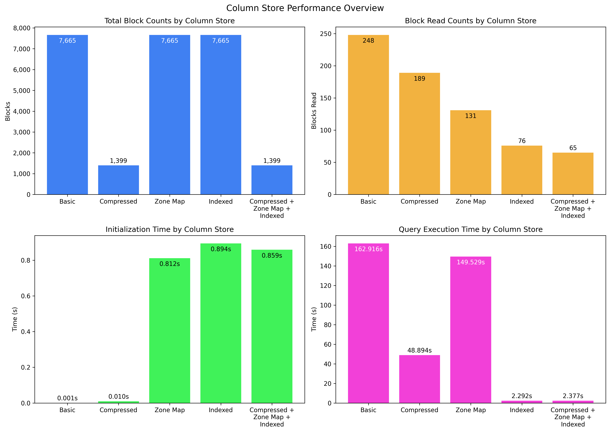
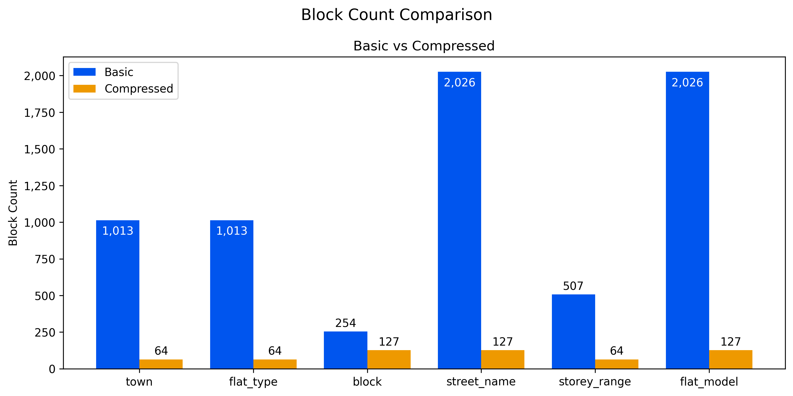

# SC4023-Project

## Overview

This project implements an on-disk column store for Singapore HDB resale flat price data, supporting five progressively optimised variants. Each column in the relation is stored as a separate binary file so that queries only read the columns they actually need, avoiding unnecessary I/O on unrelated attributes.

## Setup with uv

1. Install `uv` if it is not already available on your system.
2. From the project root, create and use the virtual environment:

   ```powershell
   uv sync
   ```

## Run Query with uv

Run the query workflow through `uv`:

```powershell
uv run main.py query
```

You can also pass the available options from `main.py`, for example:

```powershell
uv run main.py query -m A6626226B -n 10 -s -r
```

## Run Plot with uv

Run the plot workflow through `uv`:

```powershell
uv run main.py plot
```

---

## Column Store Design

The source CSV (`ResalePricesSingapore.csv`) is converted to binary column files during initialisation. Each column file stores values in row order using compact binary types (e.g. `uint8`, `uint16`, `float32`). Data is accessed in **4 KB blocks**; the store tracks how many blocks are allocated per column and how many are actually read per query.

Five store variants are implemented for side-by-side comparison. The statistics section reports both block reads and runtime split into initialisation and query execution so the cost-benefit of each optimisation is explicit.

### Overall Performance Overview



The overall averaged performance overview for the five column store after 10 runs per variant. The optimised variants show significant query-time improvements over the basic column store, with the indexed variants giving the largest gains.

### 1. Basic Column Store

Strings are stored as fixed-length byte arrays (e.g. `town` as 32 bytes, `flat_type` as 16 bytes). No compression is applied. This is the baseline design: lowest setup overhead, but highest query-time I/O and runtime in the benchmark.

### 2. Compressed Column Store

**Compression** is applied to all categorical string columns (`town`, `flat_type`, `block`, `street_name`, `storey_range`, `flat_model`). Each unique string value is assigned a small integer ID, and only the ID is stored on disk:

| Column         | Basic type       | Compressed type    | Space saving |
| -------------- | ---------------- | ------------------ | ------------ |
| `town`         | `32s` (32 bytes) | `uint8` (1 byte)   | 32×          |
| `flat_type`    | `16s` (16 bytes) | `uint8` (1 byte)   | 16×          |
| `block`        | `8s` (8 bytes)   | `uint16` (2 bytes) | 4×           |
| `street_name`  | `32s` (32 bytes) | `uint16` (2 bytes) | 16×          |
| `storey_range` | `8s` (8 bytes)   | `uint8` (1 byte)   | 8×           |
| `flat_model`   | `32s` (32 bytes) | `uint16` (2 bytes) | 16×          |

#### Basic vs Compressed Block Counts by Column



The ID-to-string mappings are persisted to `*_map.csv` files and loaded back at query time for decoding. Storing smaller values means more rows fit per 4 KB block, reducing the total block count from **7,665 → 1,399** (an 82% reduction).

In the current benchmark, this translates to a large query-time improvement over basic store (about **162.916 s → 48.894 s**) with only a small increase in initialisation time.

### 3. Zone Map Column Store

Adds **zone maps** to the column store. A zone map records the `(min, max)` value for each block of a column and is held in memory. During a scan with a range or equality predicate, any block whose `[min, max]` range cannot possibly satisfy the predicate is **skipped entirely** without an I/O read. This is particularly effective for columns with some natural ordering (e.g. `year`, `month`), allowing large swaths of the file to be pruned at query time.

In the current benchmark, total blocks read drop from **248 → 131** and query time improves from **162.916 s → 149.529 s** versus the basic store, but initialisation is higher because zone-map metadata must be built.

### 4. Indexed Column Store

Introduces an in-memory **composite index** on `(year, month, town)`. During initialisation, it builds a hash map mapping each unique combination of `(year, month, town)` to a list of matching row indices. At query time, instead of scanning columns to evaluate predicates, the engine performs direct $O(1)$ key lookup to fetch candidate rows.

This largely bypasses full-column scan work for indexed predicates and gives the largest query-time gain in the benchmark: in indexed basic mode, query time drops from **162.916 s -> 2.292 s** and total blocks read from **248 -> 76** versus the basic store.

### 5. Indexed Zone Map Compressed Column Store

Combines all three optimisations: compression, zone maps, and composite index. This further reduces total blocks read to **65** while maintaining a very low query time of **2.377 s**.

---

## Optimisation Summary

| Technique           | Benefit                                                                                             |
| ------------------- | --------------------------------------------------------------------------------------------------- |
| **Compression**     | Categorical strings replaced by 1–2 byte integer IDs; fewer blocks allocated                        |
| **Zone maps**       | Entire blocks skipped when predicate cannot match; significantly fewer block reads                  |
| **Composite Index** | Direct \(O(1)\) lookup for specific predicates; eliminates block scans entirely for indexed columns |

---

## Benchmark Results

Average benchmark results for the five column store variants when executing the same query 10 times (matric number: A6626226B):

```
========= Column Store Summary =========
Compression:   Off
Zone Maps:     Off
Indexed:       Off

Phase                           Time (s)
----------------------------------------
Initialisation                     0.001
Query Execution                  162.916
----------------------------------------
Total                            162.917

Column                  Blocks      Read
----------------------------------------
year                       127       127
month                       64         6
town                      1013        54
flat_type                 1013         6
block                      254         6
street_name               2026         7
storey_range               507         6
floor_area_sqm             254        12
flat_model                2026         7
lease_commence_date        127         5
resale_price               254        12
----------------------------------------
Total                     7665       248
========================================

========= Column Store Summary =========
Compression:   On
Zone Maps:     Off
Indexed:       Off

Phase                           Time (s)
----------------------------------------
Initialisation                     0.010
Query Execution                   48.894
----------------------------------------
Total                             48.904

Column                  Blocks      Read
----------------------------------------
year                       127       127
month                       64         6
town                        64         4
flat_type                   64         4
block                      127         5
street_name                127         5
storey_range                64         4
floor_area_sqm             254        12
flat_model                 127         5
lease_commence_date        127         5
resale_price               254        12
----------------------------------------
Total                     1399       189
========================================

========= Column Store Summary =========
Compression:   Off
Zone Maps:     On
Indexed:       Off

Phase                           Time (s)
----------------------------------------
Initialisation                     0.812
Query Execution                  149.529
----------------------------------------
Total                            150.340

Column                  Blocks      Read
----------------------------------------
year                       127        11
month                       64         5
town                      1013        54
flat_type                 1013         6
block                      254         6
street_name               2026         7
storey_range               507         6
floor_area_sqm             254        12
flat_model                2026         7
lease_commence_date        127         5
resale_price               254        12
----------------------------------------
Total                     7665       131
========================================

========= Column Store Summary =========
Compression:   Off
Zone Maps:     Off
Indexed:       (year, month, town)

Phase                           Time (s)
----------------------------------------
Initialisation                     0.894
Query Execution                    2.292
----------------------------------------
Total                              3.186

Column                  Blocks      Read
----------------------------------------
year                       127         5
month                       64         4
town                      1013         6
flat_type                 1013         6
block                      254         6
street_name               2026         7
storey_range               507         6
floor_area_sqm             254        12
flat_model                2026         7
lease_commence_date        127         5
resale_price               254        12
----------------------------------------
Total                     7665        76
========================================

========= Column Store Summary =========
Compression:   On
Zone Maps:     On
Indexed:       (year, month, town)

Phase                           Time (s)
----------------------------------------
Initialisation                     0.859
Query Execution                    2.377
----------------------------------------
Total                              3.236

Column                  Blocks      Read
----------------------------------------
year                       127         5
month                       64         4
town                        64         4
flat_type                   64         4
block                      127         5
street_name                127         5
storey_range                64         4
floor_area_sqm             254        12
flat_model                 127         5
lease_commence_date        127         5
resale_price               254        12
----------------------------------------
Total                     1399        65
========================================
```
